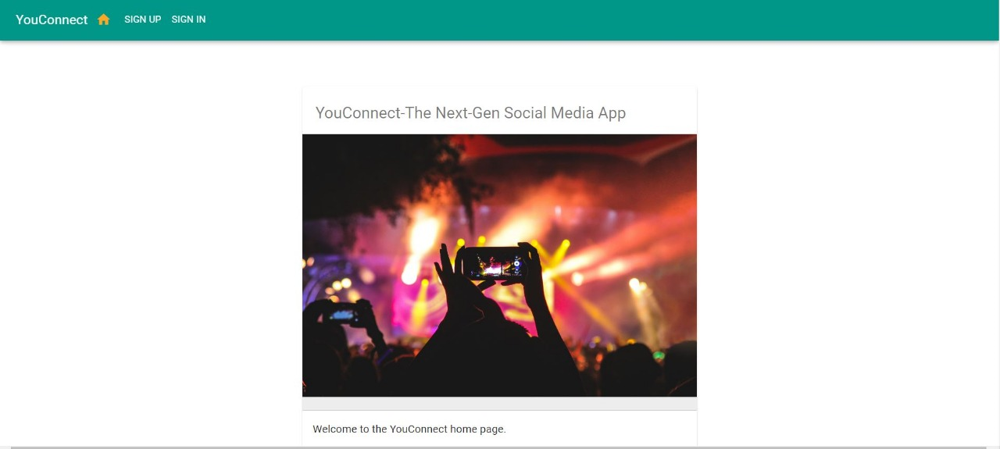
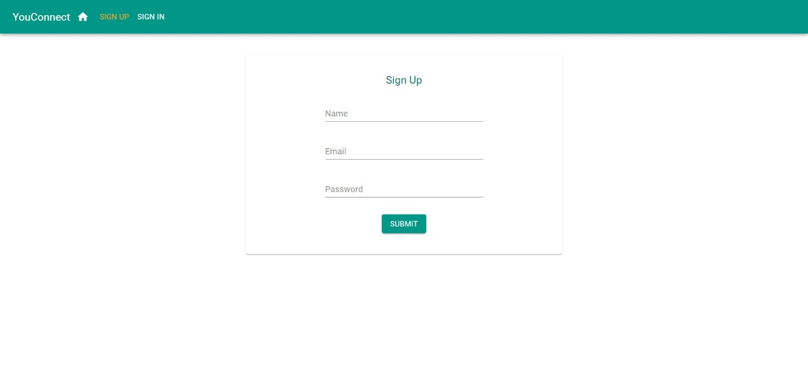
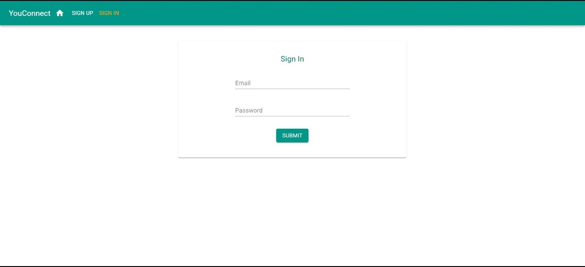
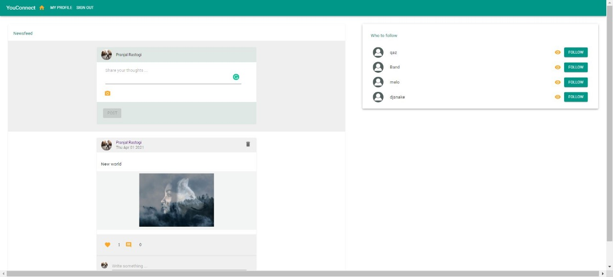
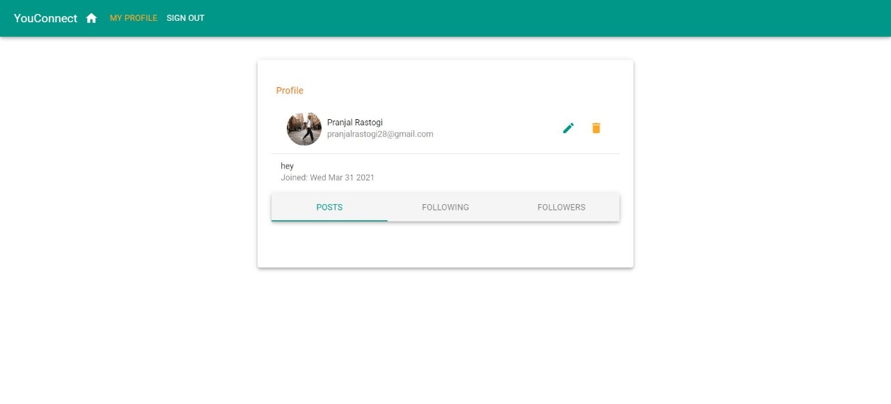
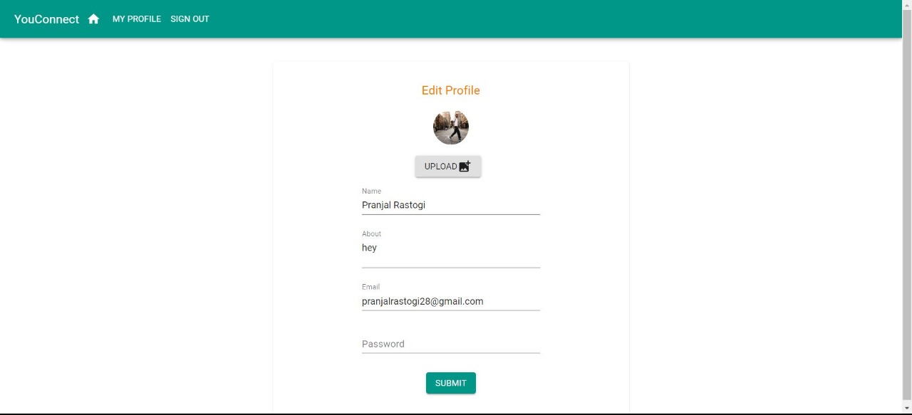

# YouConnect

YouConnect is a social media application with rudimentary features inspired by existing social media platforms such as Facebook and Twitter.
The main purpose of this application is to demonstrate how to use the MERN stack technologies to implement features that allow users to connect and interact over content.
We can extend these implementations further, as desired, for more complex features.

